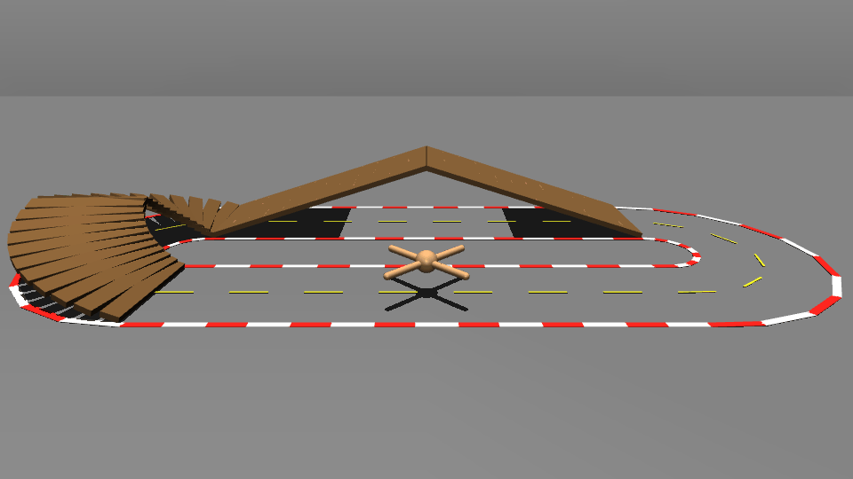
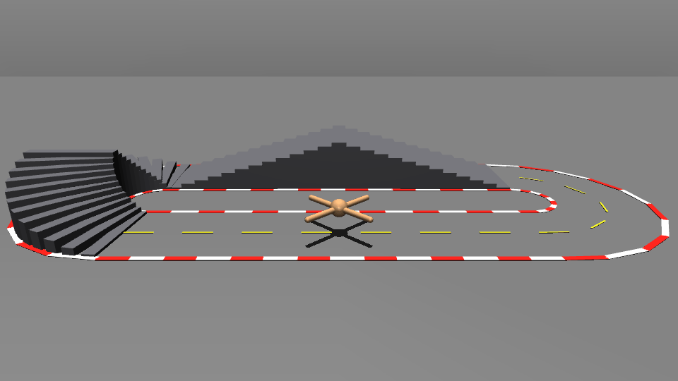
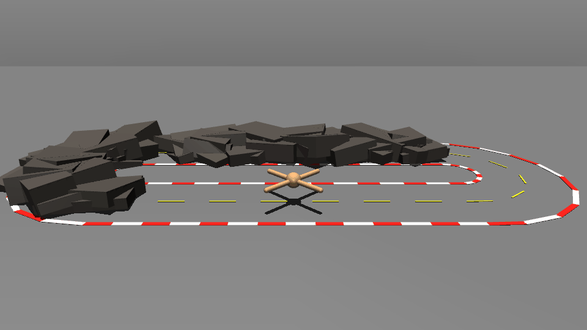
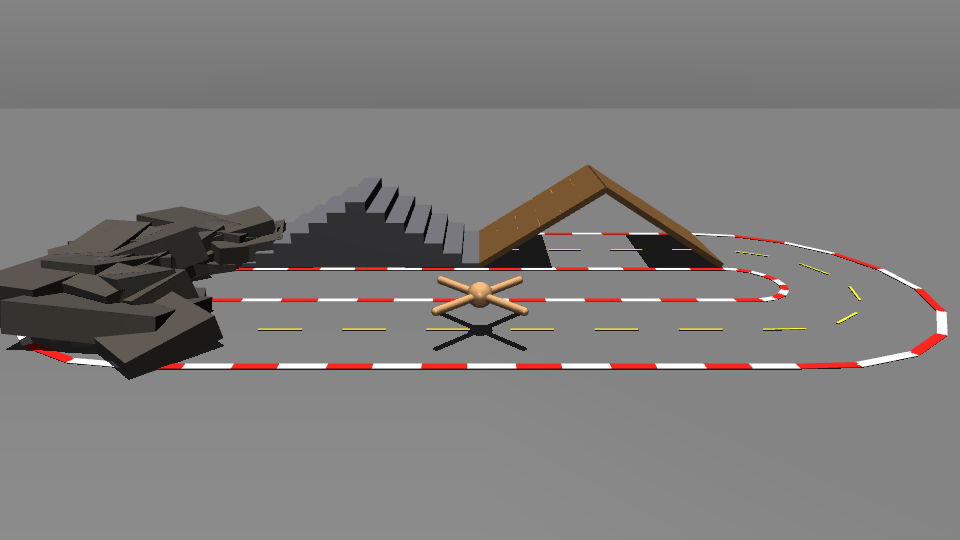
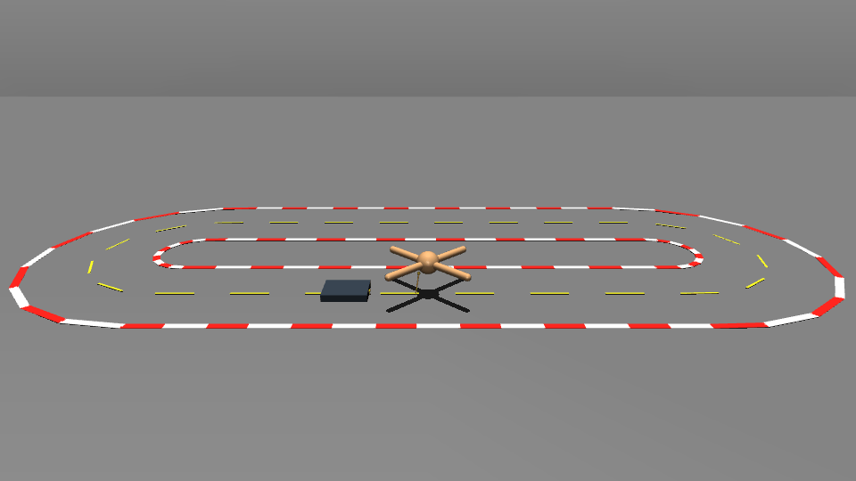
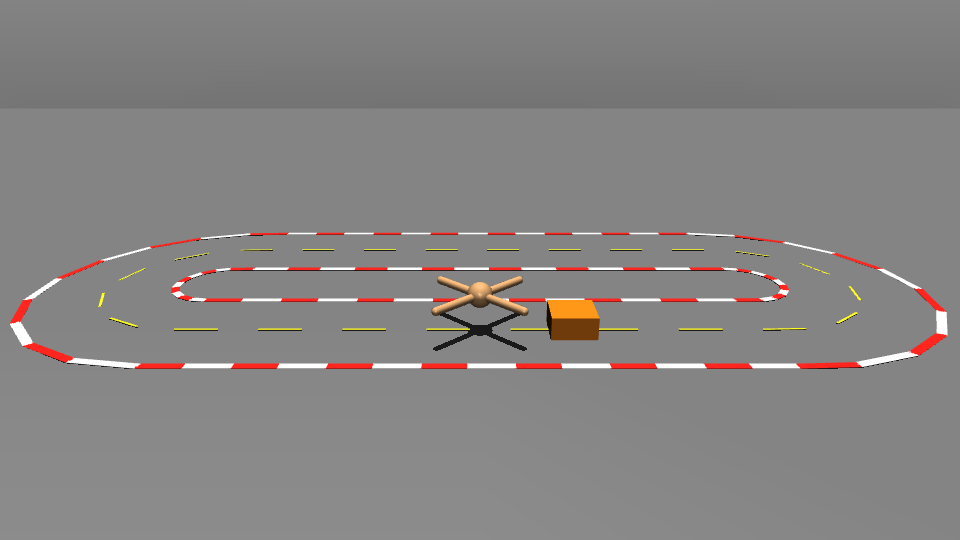
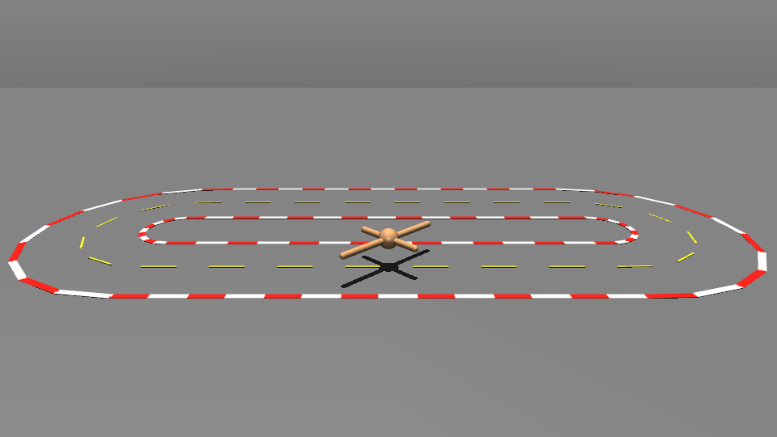

# Online refinement of policies using MPPI

<p align="center"><strong>
<a href="#results">Results</a> ·
<a href="#overview">Overview</a> ·
<a href="#requirements">Requirements</a> ·
<a href="#training-the-ant-locomotion-policy">Training</a> ·
<a href="#racing">Racing</a> ·
<a href="#terrain-transfer">Terrain Transfer</a> ·
<a href="#task-transfer">Task Transfer</a> ·
<a href="#ant-geometry-transfer">Geometry Transfer</a> ·
<a href="#plant-model-mismatch">Model Mismatch</a> ·
<a href="#replay">Replay</a> ·
<a href="#references">References</a>
</strong></p>

This project studies online refinement of a pretrained **Ant** locomotion policy with **Model Predictive Path Integral control (MPPI)** in MuJoCo.

A velocity-conditioned PPO policy provides the nominal joint-level behavior. At test time, MPPI can refine that nominal online for stadium racing and evaluate how much model-based sampling helps under terrain changes, task changes, and model mismatch.

The locomotion policy trainer is adapted from Margolis et al., **Rapid Locomotion via Reinforcement Learning** (RSS 2022 / IJRR).

* Paper: https://doi.org/10.1177/02783649231224053
* Released reference code: https://github.com/Improbable-AI/rapid-locomotion-rl

## Results

### Same-task refinement

|                       Nominal                      |                                             MPPI                                             |
| :------------------------------------------------: | :------------------------------------------------------------------------------------------: |
|  |  |

### Adaptation to novel terrain

|                          Nominal                         |                                       MPPI                                       |
| :------------------------------------------------------: | :------------------------------------------------------------------------------: |
|  |  |

|                          Nominal                          |                                        MPPI                                        |
| :-------------------------------------------------------: | :--------------------------------------------------------------------------------: |
|  |  |

|                          Nominal                         |                                           MPPI                                           |
| :------------------------------------------------------: | :--------------------------------------------------------------------------------------: |
|  |  |

|                          Nominal                         |                                           MPPI                                           |
| :------------------------------------------------------: | :--------------------------------------------------------------------------------------: |
|  |  |

### Adaptation to new tasks

|                         Nominal                         |                                      MPPI                                     |
| :-----------------------------------------------------: | :---------------------------------------------------------------------------: |
|  |  |

|                         Nominal                        |                                     MPPI                                     |
| :----------------------------------------------------: | :--------------------------------------------------------------------------: |
|  |  |

### Adaptation to modified Ant geometry

|                           Nominal                           |                                               MPPI                                              |
| :---------------------------------------------------------: | :---------------------------------------------------------------------------------------------: |
|  |  |

|                           Nominal                           |                                              MPPI                                              |
| :---------------------------------------------------------: | :--------------------------------------------------------------------------------------------: |
|  |  |

---

## Overview

The current project intentionally supports a single robot, **Ant**, and two controller variants:

| Controller variant | Description |
| --- | --- |
| `nominal` | Execute the pretrained velocity-conditioned policy directly. |
| `mppi` | Refine a policy-seeded control sequence online with MPPI. Candidate generation is selected independently with `--sampling`. |

MPPI sampling is an orthogonal configuration option:

| Sampling option | Description |
| --- | --- |
| `standard` | Standard fixed-scale direct-joint Gaussian MPPI sampling. |
| `guided` | Low-rank history-guided sampling built from recent successful MPPI update directions. |
| `diag-lowrank` | Time/joint-dependent diagonal variance adaptation plus the history-guided low-rank component. |
| `spline` | Smooth low-dimensional cubic B-spline perturbations instead of independent control noise at every horizon step. |
| `icem` | iCEM-style memory: shifted elite control sequences from the previous update are reused in the next population. |

The main pipeline is:

1. Train a velocity-conditioned Ant locomotion policy with PPO and a Grid Adaptive Curriculum.
2. Use the learned policy as the nominal controller for a 2-D stadium task.
3. Optionally refine the nominal online with MPPI.
4. Evaluate transfer to new terrain, new tasks, leg-length mismatch, and model-parameter mismatch.
5. Save exact MuJoCo states for deterministic replay and GIF export.

The MPPI controller acts directly on Ant's eight actuator controls. The pretrained policy remains the nominal source of locomotion behavior; MPPI searches locally around that behavior rather than replacing the locomotion policy.

---

## CPU MuJoCo rollout backend

Online MPPI planning is CPU-only. The controller automatically selects the fastest available MuJoCo rollout path in this order:

1. fused C++ MuJoCo physics + MPPI cost evaluation,
2. stock batched `mujoco.rollout`,
3. the legacy Python rollout loop as a compatibility fallback.

There is no rollout-backend command-line selector. When the fused extension is available it is preferred automatically.

The fused evaluator combines MuJoCo stepping with racing-cost evaluation and uses persistent MuJoCo data plus persistent worker threads to reduce Python overhead and temporary allocations. It changes the implementation of candidate evaluation, not the MPPI objective.

The active CPU path is printed at startup, for example:

```text
planner=cpu/fused/16t
```

Planner fidelity is selected independently with `--planner-mode`:

| Mode | Integrator | Planner timestep | Solver/contact profile |
| --- | --- | --- | --- |
| `rk4` | RK4 | source MuJoCo timestep | source settings |
| `fast-rk4` | RK4 | one step per control interval | fast profile |
| `implicitfast` | implicitfast | source MuJoCo timestep | fast profile |

For the default 20 ms controller and 10 ms source MuJoCo timestep, this means:

```text
rk4          -> 2 x 10 ms RK4 steps / control update
fast-rk4     -> 1 x 20 ms RK4 step  / control update
implicitfast -> 2 x 10 ms implicitfast steps / control update
```

The fast solver/contact profile caps solver iterations at 20, line-search iterations at 10, loosens tolerance to at least `1e-6`, and disables noslip iterations. `fast-rk4` is intended as a lower-cost RK4 planner while keeping the physical plant independent.

By default, the first fused candidate batch is verified against the reference rollout path before steady-state use. To disable the one-time verification after equivalence has already been established on a machine:

```bash
RACING_FUSED_VERIFY=0 python -m racing.experiments.race ...
```

---

## Requirements

### Platform

* Python **3.10+**.
* Git.
* MuJoCo **3.3+**.
* A GPU is strongly recommended for PPO training.
* The fused C++ rollout evaluator currently targets Linux/macOS and requires a C++17 compiler.
* If the fused extension is unavailable, online MPPI falls back automatically to stock `mujoco.rollout` and then to the Python compatibility path.

### 1. Create an environment

```bash
python -m venv .venv
source .venv/bin/activate
python -m pip install --upgrade pip wheel setuptools
```

### 2. Install JAX for your accelerator

Install the appropriate JAX build before the remaining project requirements.

CPU:

```bash
python -m pip install -U jax
```

NVIDIA GPU with CUDA 13 wheels:

```bash
python -m pip install -U "jax[cuda13]"
```

NVIDIA GPU with CUDA 12 wheels:

```bash
python -m pip install -U "jax[cuda12]"
```

See the current JAX installation guide for other configurations:

https://docs.jax.dev/en/latest/installation.html

### 3. Install project dependencies

From the repository root:

```bash
python -m pip install -r requirements.txt
```

Useful upstream references:

* MuJoCo MJX: https://mujoco.readthedocs.io/en/latest/mjx.html
* MuJoCo Warp: https://mujoco.readthedocs.io/en/latest/mjwarp/index.html
* MuJoCo Playground: https://github.com/google-deepmind/mujoco_playground

Verify the environment:

```bash
python - <<'PY'
import jax
import mujoco
from mujoco import mjx
import mujoco_playground
print("JAX backend:", jax.default_backend())
print("JAX devices:", jax.devices())
print("MuJoCo:", mujoco.__version__)
print("MJX import: OK")
print("MuJoCo Playground import: OK")
PY
```

For GPU training, `jax.default_backend()` should normally report `gpu`.

### 4. Build the fused C++ rollout backend

This step is optional but recommended for real-time MPPI.

On Debian/Ubuntu:

```bash
sudo apt install build-essential
```

Build the extension in place:

```bash
python racing/setup_native.py build_ext --inplace
```

Verify it:

```bash
python - <<'PY'
from racing import _fused_mujoco
print("Fused MuJoCo extension:", _fused_mujoco.__file__)
PY
```

---

## Training the Ant locomotion policy

The main trainer is:

```bash
python -m racing.policies.train_velocity_policy
```

The standard Ant checkpoint directory is:

```text
racing/policies/checkpoints/ant_rapid
```

This is also the checkpoint loaded by racing when `--policy auto` is used.

### Fixed-budget training

```bash
python -m racing.policies.train_velocity_policy \
  --robot ant \
  --impl warp \
  --num-envs 4096 \
  --steps 400000000 \
  --phase-steps 20000000 \
  --contacts-per-env 8 \
  --njmax 512 \
  --output racing/policies/checkpoints/ant_rapid
```

The default control period is 0.02 s / 50 Hz. The curriculum starts around `v_x = +/-1 m/s` and yaw rate `+/-1 rad/s`, using 0.5-unit grid spacing, then expands through native-MuJoCo frontier evaluation.

### PPO defaults

| Setting                  |             Default |
| ------------------------ | ------------------: |
| Environments             |                4096 |
| Total training steps     |         400,000,000 |
| Curriculum phase         |    20,000,000 steps |
| Discount                 |                0.99 |
| GAE lambda               |                0.95 |
| PPO rollout length       |                  21 |
| PPO epochs per rollout   |                   5 |
| Minibatches              |                   4 |
| Batch size               |                1024 |
| Entropy cost             |                0.01 |
| PPO clip epsilon         |                 0.2 |
| Learning rate            |                1e-3 |
| Max gradient norm        |                 1.0 |
| Policy network           | 512, 256, 128 / ELU |
| Value network            | 512, 256, 128 / ELU |
| Initial action noise std |                 1.0 |

### Continue until the certified straight-speed envelope stalls

```bash
python -m racing.policies.train_velocity_policy \
  --robot ant \
  --impl warp \
  --num-envs 4096 \
  --phase-steps 20000000 \
  --contacts-per-env 8 \
  --njmax 512 \
  --output racing/policies/checkpoints/ant_rapid \
  --resume \
  --until-failure \
  --stall-patience 4 \
  --max-phases 100
```

Optionally set an absolute ceiling:

```text
--max-forward-speed 10.0
```

### Resume a fixed-budget run

```bash
python -m racing.policies.train_velocity_policy \
  --robot ant \
  --output racing/policies/checkpoints/ant_rapid \
  --resume
```

### Test the trained policy

```bash
python -m racing.policies.test_velocity_policy \
  --robot ant \
  --policy racing/policies/checkpoints/ant_rapid
```

---

## Racing

The main entry point is:

```bash
python -m racing.experiments.race
```

A run saves exact MuJoCo state history to `racing/results/last_run.npz` by default.

### Nominal policy

```bash
python -m racing.experiments.race \
  --robot ant \
  --policy auto \
  --variant nominal
```

`nominal` executes one closed-loop policy action per control tick and does not perform MPPI rollout optimization.

### MPPI

```bash
python -m racing.experiments.race \
  --robot ant \
  --policy auto \
  --variant mppi \
  --rollouts 32 \
  --horizon 50 \
  --joint-noise 0.5
```

`mppi` is the default controller variant.

### MPPI sampling options

`--sampling` changes **only candidate generation inside MPPI**. The controller remains `--variant mppi`, with the same policy-seeded nominal, nonlinear MuJoCo rollout physics, racing/task objective, LBPS temperature selection, actuator clipping, and exponentially weighted MPPI control update. This separation makes controller design and sampling design independent.

The non-standard sampling options are implementation-specific adaptations inspired by the cited methods below; they are **not exact reproductions** of Guided ES, CMA-ES, Model Tensor Planning, or iCEM.

#### Guided low-rank sampling (`--sampling guided`)

`guided` stores recent full-horizon MPPI update directions, shifts them with the receding horizon, and orthonormalizes the most recent directions into a low-rank basis. The next proposal mixes ordinary full-space MPPI noise with noise inside that history subspace. The expected proposal trace is renormalized so the method reallocates the standard exploration budget instead of simply adding more noise.

This is inspired by Guided Evolutionary Strategies, which elongates a random-search distribution along a low-dimensional guiding subspace [1]. Here the guiding vectors are previous MPPI update directions rather than external surrogate gradients.

```bash
python -m racing.experiments.race \
  --variant mppi \
  --sampling guided \
  --rollouts 32 \
  --horizon 50 \
  --joint-noise 0.5 \
  --guided-rank 6 \
  --guided-fraction 0.5 \
  --profile
```

Key parameters:

| Option | Default | Meaning |
| --- | ---: | --- |
| `--guided-rank N` | `6` | Maximum number of recent update directions retained in the guiding subspace. |
| `--guided-fraction FLOAT` | `0.50` | Fraction of proposal energy assigned to the learned low-rank component before trace renormalization. |

#### Diagonal + low-rank sampling (`--sampling diag-lowrank`)

`diag-lowrank` extends `guided` with an adaptive normalized variance for every `(horizon step, actuator)` pair. The diagonal target is estimated from the MPPI-weighted applied perturbations. With a small rollout population, the update is deliberately conservative: low ESS shrinks the estimate back toward standard MPPI, the variance is clipped, smoothed with an EMA, renormalized to preserve the average exploration scale, and shifted with the warm start.

The diagonal covariance-adaptation idea is inspired by the covariance adaptation principles of CMA-ES [2], while the low-rank history component follows the guided-subspace idea in [1]. This controller does not implement the full CMA-ES algorithm.

```bash
python -m racing.experiments.race \
  --variant mppi \
  --sampling diag-lowrank \
  --rollouts 32 \
  --horizon 50 \
  --joint-noise 0.5 \
  --guided-rank 6 \
  --guided-fraction 0.5 \
  --diag-lowrank-rate 0.08 \
  --diag-lowrank-min 0.25 \
  --diag-lowrank-max 4.0 \
  --profile
```

Key parameters:

| Option | Default | Meaning |
| --- | ---: | --- |
| `--diag-lowrank-rate FLOAT` | `0.08` | EMA rate for the time/joint variance update. |
| `--diag-lowrank-min FLOAT` | `0.25` | Minimum normalized variance factor before renormalization. |
| `--diag-lowrank-max FLOAT` | `4.0` | Maximum normalized variance factor before renormalization. |

#### B-spline latent sampling (`--sampling spline`)

`spline` samples a small set of cubic B-spline coefficients per actuator and expands them into the full horizon. With the default `H=50`, eight Ant actuators, and six spline modes, the stochastic proposal is parameterized by `6 x 8 = 48` latent coefficients rather than 400 independent time/joint values. The basis is row-normalized so `joint_noise` remains approximately comparable to the standard MPPI scale. Because the spline perturbation is already temporally smooth, the standard AR temporal-noise filter is not applied a second time.

This sampling option is inspired by structured spline control-trajectory sampling, including the B-spline trajectory parameterization used in Model Tensor Planning [3]. It implements only the low-dimensional B-spline proposal, not the tensor-sampling algorithm of that paper.

```bash
python -m racing.experiments.race \
  --variant mppi \
  --sampling spline \
  --rollouts 32 \
  --horizon 50 \
  --joint-noise 0.5 \
  --spline-modes 6 \
  --profile
```

| Option | Default | Meaning |
| --- | ---: | --- |
| `--spline-modes N` | `6` | Number of cubic B-spline latent modes per actuator; values below four are raised to four. |

#### iCEM-style elite reuse (`--sampling icem`)

`icem` retains the best finite-cost control sequences from the previous controller update. At the next MPC step those sequences are shifted by one horizon step and inserted into the new candidate population; the remaining candidates are sampled using the standard MPPI proposal. The controller still uses LBPS and the standard MPPI weighted update rather than a CEM elite-mean update.

This is inspired by the memory/sample-reuse mechanism in sample-efficient iCEM [4].

```bash
python -m racing.experiments.race \
  --variant mppi \
  --sampling icem \
  --rollouts 32 \
  --horizon 50 \
  --joint-noise 0.5 \
  --icem-elites 4 \
  --profile
```

| Option | Default | Meaning |
| --- | ---: | --- |
| `--icem-elites N` | `4` | Number of best previous control sequences shifted and reused in the next rollout population. |

For controlled sampling comparisons, keep `--variant mppi`, `--seed`, `--rollouts`, `--horizon`, `--joint-noise`, planner physics, plant physics, task, and terrain fixed and change only `--sampling` plus sampling-specific parameters.

Warm-starting is enabled by default. Use:

```text
--no-warm-start
```

to disable it.

### MPPI planner physics modes

The default planner uses full RK4 with the source MuJoCo timestep and solver/contact settings:

```bash
python -m racing.experiments.race \
  --robot ant \
  --policy auto \
  --variant mppi \
  --rollouts 32 \
  --horizon 50 \
  --joint-noise 0.5 \
  --workers 16 \
  --planner-mode rk4 \
  --profile
```

For a cheaper RK4 planner, use:

```text
--planner-mode fast-rk4
```

`fast-rk4` keeps RK4 but sets the planner timestep equal to the control period, so the default 20 ms control interval requires one planner `mj_step` instead of two 10 ms steps. It also uses the fast solver/contact profile.

For the cheapest supported MuJoCo planner profile, use:

```text
--planner-mode implicitfast
```

`implicitfast` keeps the source planner timestep and uses the same fast solver/contact profile. The physical plant remains independent; use `--plant-integrator` only when intentionally changing the plant integrator.

At startup, the program prints both plant and planner stepping, for example:

```text
plant=model:2x0.01s  planner_mode=fast-rk4:1x0.02s
```

---

## Terrain transfer

The PPO policy remains the same flat-ground pretrained controller while the MuJoCo plant/planner terrain changes at test time.

```bash
python -m racing.experiments.race \
  --robot ant \
  --policy auto \
  --variant mppi \
  --terrain ramps
```

Available terrain modes:

```text
flat
ramps
stairs
rocky
mixed
```

Useful controls:

```text
--terrain-seed N
--terrain-scale FLOAT
```

---

## Task transfer

The same pretrained running policy can be used for additional flat-ground tasks.

### Push a box

```bash
python -m racing.experiments.race \
  --robot ant \
  --policy auto \
  --variant mppi \
  --task push_box
```

The push task uses a **box only**.

Useful box parameters include:

```text
--box-distance FLOAT
--box-size FLOAT
--box-height FLOAT
--box-mass FLOAT
--box-friction FLOAT
--push-box-progress-weight FLOAT
--push-robot-progress-weight FLOAT
--push-approach-weight FLOAT
--push-box-max-lift FLOAT
--push-box-min-up FLOAT
```

### Tow a sled

```bash
python -m racing.experiments.race \
  --robot ant \
  --policy auto \
  --variant mppi \
  --task tow_sled
```

Useful sled parameters include:

```text
--sled-distance FLOAT
--sled-length FLOAT
--sled-width FLOAT
--sled-height FLOAT
--sled-mass FLOAT
--sled-friction FLOAT
--sled-rope-length FLOAT
--sled-progress-weight FLOAT
--sled-robot-progress-weight FLOAT
--sled-max-lift FLOAT
--sled-min-up FLOAT
```

`push_box` and `tow_sled` require flat terrain.

---

## Ant geometry transfer

Known leg-length mismatches can be applied to both the physical plant and planning model while keeping the PPO policy nominal-pretrained.

Same-side mismatch:

```bash
python -m racing.experiments.race \
  --robot ant \
  --policy auto \
  --variant mppi \
  --leg-mismatch same_side
```

Diagonal mismatch:

```bash
python -m racing.experiments.race \
  --robot ant \
  --policy auto \
  --variant mppi \
  --leg-mismatch diagonal
```

The short/long leg scales can be changed with:

```text
--short-leg-scale 0.75
--long-leg-scale 1.25
```

---

## Plant-model mismatch

The physical plant can be perturbed without giving those perturbations directly to the planning model. This is useful for evaluating model mismatch between the online MPPI planner and the simulated plant.

```bash
python -m racing.experiments.race \
  --robot ant \
  --policy auto \
  --variant mppi \
  --friction-scale 0.8 \
  --mass-scale 1.15 \
  --motor-scale 0.9 \
  --slope-deg 2.0
```

The available plant perturbations are:

```text
--friction-scale FLOAT
--mass-scale FLOAT
--motor-scale FLOAT
--slope-deg FLOAT
```

These parameters modify the physical plant only. The planning copy starts from the nominal model, so the run measures transfer under unobserved model mismatch.

---

## Empirical spatial prior

Without `--prior`, racing uses the geometric prior.

To load a saved empirical prior:

```text
--prior path/to/prior.npz
```

---

## Core racing options

| Option | Default | Description |
| --- | --- | --- |
| `--robot ant` | `ant` | The only supported racing robot. |
| `--policy SPEC` | `auto` | Loads `racing/policies/checkpoints/ant_rapid` automatically or accepts an explicit checkpoint/specification. |
| `--policy-speed MPS` | none | Optional maximum racing-speed cap. |
| `--laps N` | `1` | Requested laps. |
| `--variant {nominal,mppi}` | `mppi` | Controller family: direct nominal-policy execution or MPPI refinement. |
| `--sampling {standard,guided,diag-lowrank,spline,icem}` | `standard` | Candidate-generation strategy used by MPPI; non-standard values require `--variant mppi`. |
| `--rollouts N` | `32` | MPPI candidate trajectories per update. |
| `--horizon N` | `50` | MPPI horizon in control steps. |
| `--dt SEC` | policy dt | Control period. |
| `--lbps-delta FLOAT` | `0.95` | Adaptive-temperature target. |
| `--joint-noise FLOAT` | `0.5` | Actuator-range MPPI exploration scale. |
| `--guided-rank N` | `6` | History-subspace rank used by `guided` and `diag-lowrank`. |
| `--guided-fraction FLOAT` | `0.50` | Low-rank proposal fraction used by `guided` and `diag-lowrank`. |
| `--diag-lowrank-rate FLOAT` | `0.08` | EMA rate for adaptive time/joint variances. |
| `--diag-lowrank-min FLOAT` | `0.25` | Minimum normalized adaptive diagonal variance factor. |
| `--diag-lowrank-max FLOAT` | `4.0` | Maximum normalized adaptive diagonal variance factor. |
| `--spline-modes N` | `6` | Cubic B-spline latent modes per actuator. |
| `--icem-elites N` | `4` | Shifted previous elites reused by the `icem` proposal. |
| `--nominal-refine-iters N` | `0` | Optional policy-nominal refinement. |
| `--seed N` | `1` | Controller random seed. |
| `--workers N` | `16` | Persistent native rollout worker threads; `0` selects automatically. |
| `--rollout-chunk-size N` | `0` | Worker-pool chunk size; `0` selects automatically. |
| `--warm-start / --no-warm-start` | enabled | Shift the previous optimized sequence between MPPI updates. |
| `--plant-integrator {model,euler,implicitfast}` | `model` | Physical-plant integrator; `model` preserves the source XML setting. |
| `--planner-mode {rk4,fast-rk4,implicitfast}` | `rk4` | Planner physics profile. `fast-rk4` uses one RK4 step per control interval; `implicitfast` uses the source timestep. Both fast modes use the cheaper solver/contact profile. |
| `--task {run,push_box,tow_sled}` | `run` | Test-time task. |
| `--terrain {flat,ramps,stairs,rocky,mixed}` | `flat` | Test-time terrain. |
| `--terrain-seed N` | `1` | Deterministic rocky/mixed terrain seed. |
| `--terrain-scale FLOAT` | `1.0` | Terrain obstacle/ramp scale. |
| `--leg-mismatch {none,same_side,diagonal}` | `none` | Known Ant leg-length mismatch. |
| `--short-leg-scale FLOAT` | `0.75` | Short-leg scale when geometry mismatch is enabled. |
| `--long-leg-scale FLOAT` | `1.25` | Long-leg scale when geometry mismatch is enabled. |
| `--friction-scale FLOAT` | `1.0` | Plant friction scale. |
| `--mass-scale FLOAT` | `1.0` | Plant mass scale. |
| `--motor-scale FLOAT` | `1.0` | Plant actuator-strength scale. |
| `--slope-deg FLOAT` | `0.0` | Plant ground slope. |
| `--profile` | off | Print compact controller timing statistics. |
| `--disable-gc` | off | Disable Python cyclic GC during the race loop to reduce timing jitter. |
| `--max-steps N` | none | Optional control-step limit. |
| `--headless` | off | Disable viewer. |
| `--viewer-ui` | off | Show MuJoCo left/right viewer panels. |
| `--controller-overlay` | off | Enable the controller overlay. |
| `--save PATH` | `racing/results/last_run.npz` | Save exact trajectory for replay. |
| `--no-save` | off | Disable replay-file saving. |

For all options:

```bash
python -m racing.experiments.race --help
```

---

## Profiling real-time performance

Add:

```text
--profile
```

The per-update profiler prints only the active timing components: nominal construction, sampling, rollout evaluation, MPPI update, total latency, the control deadline, and an `OK`/`MISS` deadline status. `refine` and real-time-factor (`xRT`) fields are not printed.

Example steady-state output:

```text
MPPI [    2]  nominal    2.93 ms (warm 2.76, prior 0.16)  |  sample   0.45 ms  |  rollout    9.15 ms (fused 8.72)  |  update   0.49 ms  |  total   13.02 / 20.00 ms  [OK]
```

The final summary excludes the first five warm-up updates and reports aligned p50/p95 stage timing plus the deadline-miss percentage.

For a 50 Hz controller, a useful target is approximately:

```text
p95 total < 20 ms
deadline misses close to 0%
```

When comparing planner configurations, record at least:

* lap time or task progress,
* fall/off-track outcome,
* MPPI effective sample size,
* rollout and total p50/p95 latency,
* deadline misses.

For CPU rollout tuning, benchmark `--workers` and `--rollout-chunk-size` on the target machine. The fused evaluator is selected automatically when the extension is available.

---

## Replay

Replay restores exact saved MuJoCo states. It does **not** rerun PPO or MPPI.

```bash
python -m racing.experiments.replay \
  --file racing/results/last_run.npz
```

At 2x speed:

```bash
python -m racing.experiments.replay \
  --file racing/results/last_run.npz \
  --speed 2
```

Replay an interval:

```bash
python -m racing.experiments.replay \
  --file racing/results/last_run.npz \
  --start 2.0 \
  --end 8.0
```

---

## GIF export

```bash
python -m racing.experiments.replay \
  --file racing/results/last_run.npz \
  --gif racing/results/mppi.gif
```

Set output properties explicitly:

```bash
python -m racing.experiments.replay \
  --file racing/results/last_run.npz \
  --gif racing/results/mppi.gif \
  --gif-fps 50 \
  --gif-width 960 \
  --gif-height 540
```

---

## Typical end-to-end workflow

### 1. Train

```bash
python -m racing.policies.train_velocity_policy \
  --robot ant \
  --impl warp \
  --num-envs 4096 \
  --phase-steps 20000000 \
  --contacts-per-env 8 \
  --output racing/policies/checkpoints/ant_rapid \
  --until-failure \
  --stall-patience 4 \
  --max-phases 100
```

### 2. Build the fused evaluator

```bash
python racing/setup_native.py build_ext --inplace
```

### 3. Run the nominal baseline

```bash
python -m racing.experiments.race \
  --robot ant \
  --policy auto \
  --variant nominal
```

### 4. Run MPPI

```bash
python -m racing.experiments.race \
  --robot ant \
  --policy auto \
  --variant mppi \
  --rollouts 32 \
  --horizon 50 \
  --joint-noise 0.5 \
  --workers 16 \
  --planner-mode rk4 \
  --profile
```

### 5. Replay

```bash
python -m racing.experiments.replay \
  --file racing/results/last_run.npz
```

### 6. Export a GIF

```bash
python -m racing.experiments.replay \
  --file racing/results/last_run.npz \
  --gif racing/results/mppi.gif
```

---

## Notes on reproducibility and performance

* Use the same `--seed`, horizon, rollout count, `--joint-noise`, plant/planner physics settings, task, and terrain when comparing MPPI sampling options.
* The first JAX policy call includes JIT compilation and is much slower than steady-state inference.
* MPPI warm start is enabled by default.
* Online MPPI rollouts are CPU MuJoCo. The controller automatically prefers the fused C++ evaluator, then stock `mujoco.rollout`, then the Python compatibility path.
* `--planner-mode rk4` is the fidelity-oriented planner profile: explicit RK4, source planner timestep, and source solver/contact settings.
* `--planner-mode fast-rk4` keeps RK4 but uses one planner step per control interval plus the fast solver/contact profile. With the default 20 ms control period and 10 ms source timestep, this changes the planner from `2 x 10 ms` to `1 x 20 ms` while leaving the plant unchanged.
* `--planner-mode implicitfast` uses MuJoCo `implicitfast` at the source timestep with the same fast solver/contact profile.
* Plant and planner substep counts are computed independently. Changing planner mode does not change how far the physical plant advances per control update.
* Thread count and rollout chunk size are machine dependent; benchmark them on the target CPU.
* GIF export uses saved states, so rendering does not alter the racing result.

## References

The non-standard sampling options above are implementation-specific adaptations of the following ideas; the citations identify the main methodological inspiration rather than claiming exact reproduction.

[1] Maheswaranathan, N., Metz, L., Tucker, G., Choi, D., & Sohl-Dickstein, J. *Guided evolutionary strategies: augmenting random search with surrogate gradients*. Proceedings of the 36th International Conference on Machine Learning (ICML), PMLR 97:4264-4273, 2019. https://proceedings.mlr.press/v97/maheswaranathan19a.html

[2] Hansen, N. *The CMA Evolution Strategy: A Tutorial*. arXiv:1604.00772, 2016. https://arxiv.org/abs/1604.00772

[3] Le, A. T., Nguyen, K., Vu, M. N., Carvalho, J., & Peters, J. *Model Tensor Planning*. Transactions on Machine Learning Research, 2025. https://arxiv.org/abs/2505.01059

[4] Pinneri, C., Sawant, S., Blaes, S., Achterhold, J., Stueckler, J., Rolinek, M., & Martius, G. *Sample-efficient Cross-Entropy Method for Real-time Planning*. Proceedings of the 2020 Conference on Robot Learning, PMLR 155:1049-1065, 2021. https://proceedings.mlr.press/v155/pinneri21a.html

[5] Margolis, G. B., Yang, G., Paigwar, K., Chen, T., & Agrawal, P. *Rapid Locomotion via Reinforcement Learning*. International Journal of Robotics Research. https://doi.org/10.1177/02783649231224053
