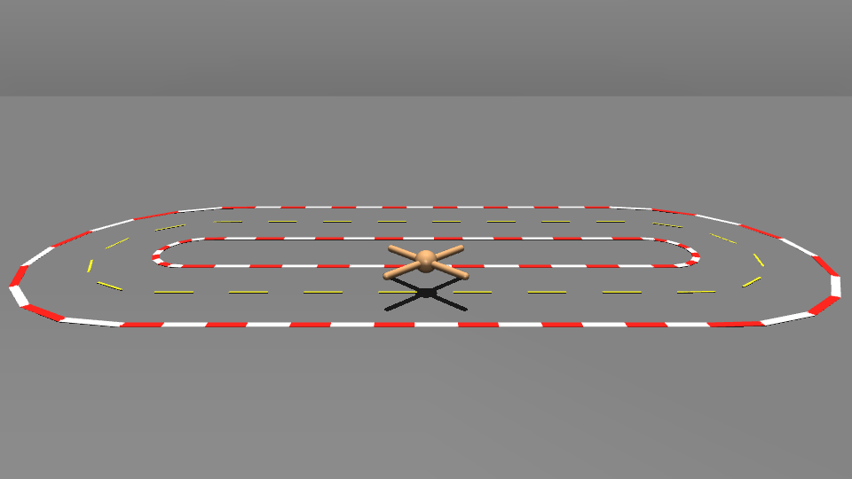

# Racing: Rapid-Locomotion policy + direct-joint SPG-MPPI + online MuJoCo adaptation

This project uses the MuJoCo locomotion robots, with **Ant** as
the primary 2-D stadium racer.  The default policy trainer is an adaptation of
Margolis et al., *Rapid Locomotion via Reinforcement Learning* (RSS 2022 / IJRR) and an MPPI refines the policy for racing.

Paper: https://doi.org/10.1177/02783649231224053

Released reference code: https://github.com/Improbable-AI/rapid-locomotion-rl

<b>Nominal (19.38s)</b>

  

<b>Standard MPPI (17.06s)</b>

  

<b>Sensitivity Projected Gaussian MPPI (10.52s)</b>

  

