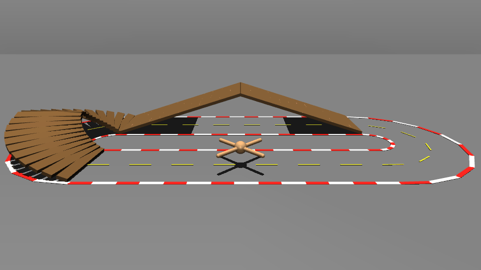
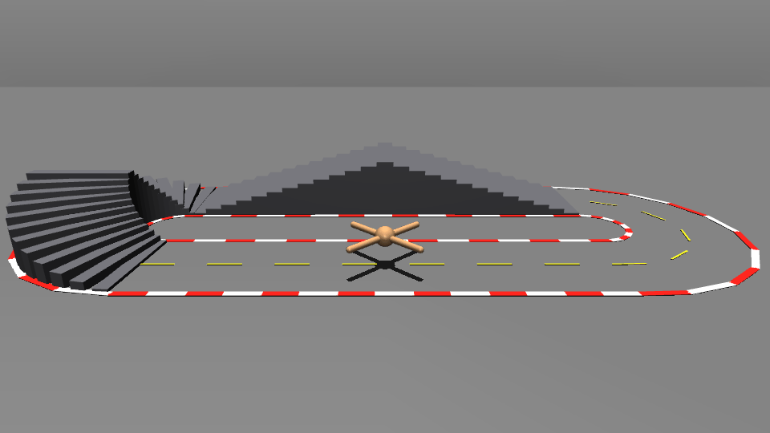
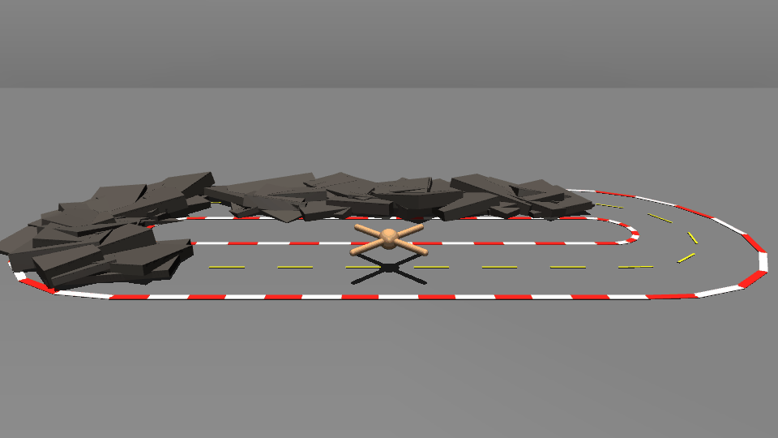
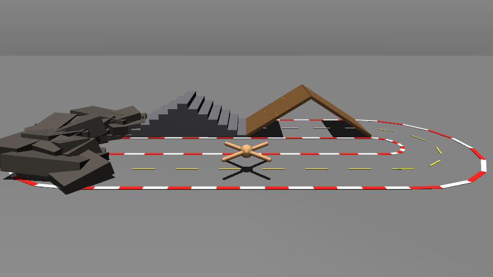
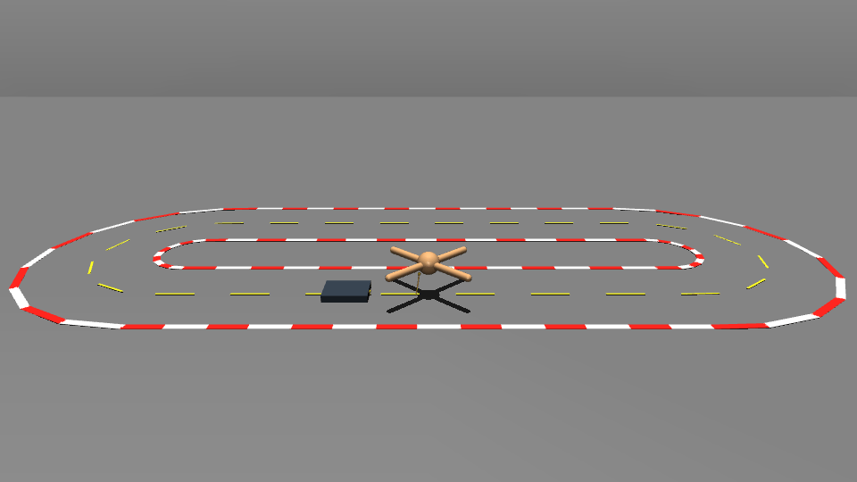
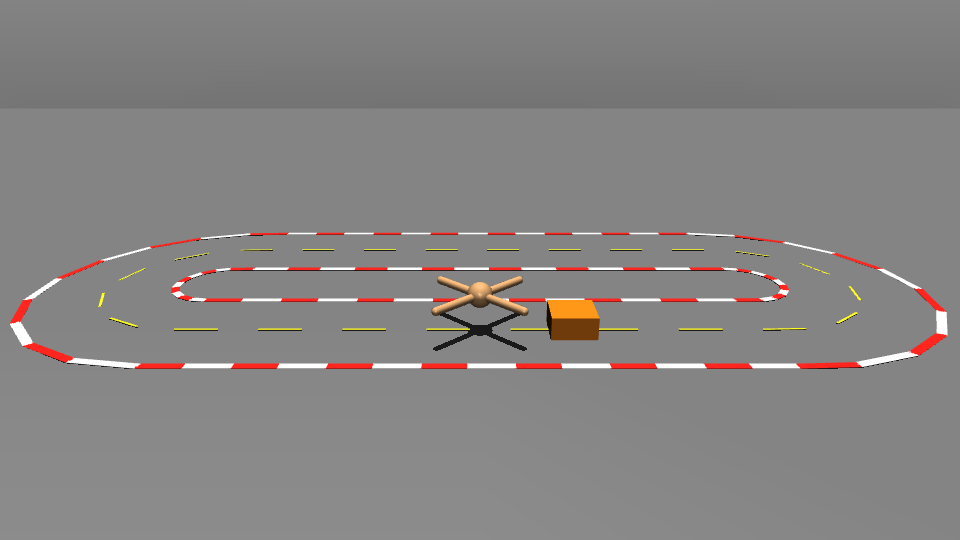
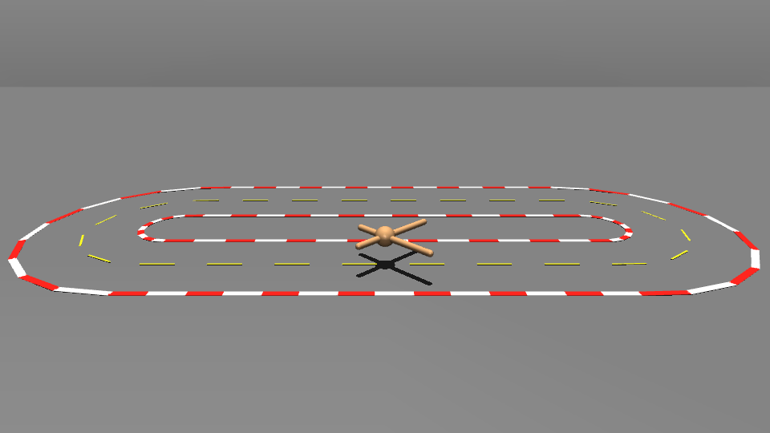
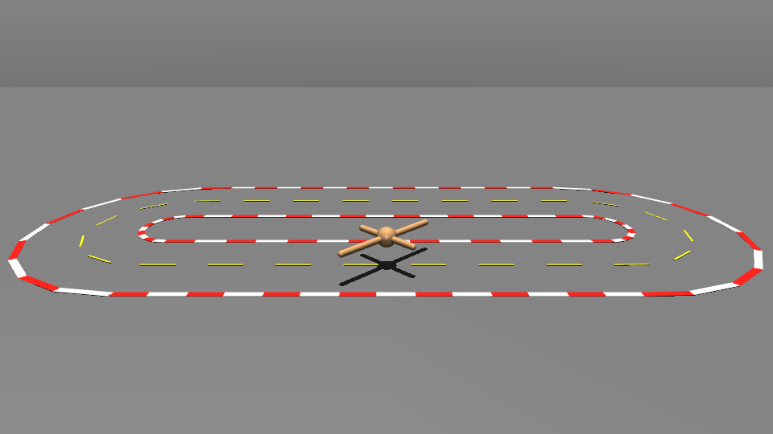

# Online refinement of policies using MPPI

This project uses MuJoCo locomotion robots, with **Ant** as the primary 2-D stadium racer. A velocity-conditioned locomotion policy provides the nominal behavior, and Model Predictive Path Integral control (MPPI) refines that policy online for racing, terrain transfer, task transfer, and robot-model transfer.

The default policy trainer is adapted from Margolis et al., *Rapid Locomotion via Reinforcement Learning* (RSS 2022 / IJRR).

- Paper: https://doi.org/10.1177/02783649231224053
- Released reference code: https://github.com/Improbable-AI/rapid-locomotion-rl

## Results

### Same-task refinement

| Nominal | SPG-MPPI |
|:---:|:---:|
|  |  |

### Adaptation to novel terrain

| Nominal | SPG-MPPI |
|:---:|:---:|
|  |  |

| Nominal | SPG-MPPI |
|:---:|:---:|
|  |  |

| Nominal | SPG-MPPI |
|:---:|:---:|
|  |  |

| Nominal | SPG-MPPI |
|:---:|:---:|
|  |  |

### Adaptation to new tasks

| Nominal | SPG-MPPI |
|:---:|:---:|
|  |  |

| Nominal | SPG-MPPI |
|:---:|:---:|
|  |  |

| Nominal | SPG-MPPI |
|:---:|:---:|
|  |  |

### Adaptation to new robot models

| Nominal | SPG-MPPI |
|:---:|:---:|
|  |  |

| Nominal | SPG-MPPI |
|:---:|:---:|
|  |  |

---

## Overview

The pipeline has four main stages:

1. **Train a velocity-conditioned locomotion policy** with PPO and a Grid Adaptive Curriculum.
2. **Use the learned policy as the nominal controller** for a stadium racing task.
3. **Refine the nominal online with MPPI**, optionally using Sensitivity Projected Gaussian (SPG) exploration and online model adaptation.
4. **Save and replay exact MuJoCo states**, either interactively or as a GIF.

The racing code currently supports four controller variants:

| Variant | Description |
| --- | --- |
| `policy_nominal` | Execute the policy-derived nominal without MPPI refinement. |
| `standard_mppi` | Standard direct-joint MPPI around the policy/warm-start nominal. |
| `spg_mppi` | Classic SPG-MPPI. A single future task endpoint is used to project spatial uncertainty into actuator space. This is the default variant. |
| `spg_time_mppi` | Time-dependent SPG-MPPI. Each control row keeps sensitivity to several future task positions so spatial variance can change over the future horizon. |

The project also includes an optional **fused C++ MuJoCo rollout evaluator** for low-latency planning. The fused backend now handles candidate rollouts, warm-start nominal rollout, classic SPG finite differences, and time-dependent SPG sensitivities using persistent MuJoCo data and worker threads.

---

## SPG controllers

### Classic SPG-MPPI: `spg_mppi`

Classic SPG uses a finite-difference task Jacobian for each control row `k`:

```text
J[k] = d y[k + L] / d z[k]
```

where:

- `z[k]` is the actuator-control vector at control row `k`,
- `y` is the 2-D task position used by the spatial prior,
- `L = --spg-lookahead`.

The spatial prior is centered around the nominal endpoint using the second-moment correction

```text
d[k] = prior_mean[k] - nominal_endpoint[k]
C[k] = prior_cov[k] + d[k] d[k]^T
```

and mapped into actuator space through the damped pseudoinverse

```text
J_dag[k] = J[k]^T (J[k] J[k]^T + lambda I)^-1
```

The SPG task-space factor is then combined with null-space exploration and, when `--spg-mix < 1`, ordinary actuator noise. The proposal remains **zero mean**: the displacement term changes exploration variance but does not add a deterministic control correction.

### Time-dependent SPG-MPPI: `spg_time_mppi`

`spg_time_mppi` extends the same SPG proposal without changing the MPPI update rule.

Instead of retaining only one endpoint Jacobian, one actuator perturbation at control row `k` is propagated through a future window and every task boundary is retained:

```text
H[k, ell] = d y[k + ell + 1] / d z[k]
             ell = 0, ..., W - 1
```

where `W = --spg-lookahead`.

For each row, the valid future sensitivities are stacked:

```text
H_k = d [y[k+1], y[k+2], ..., y[k+W]] / d z[k]
```

and the controller computes the damped local inverse

```text
G_k ~= d z[k] / d [y[k+1], y[k+2], ..., y[k+W]]
```

using a Tikhonov pseudoinverse of the stacked sensitivity matrix.

Each future spatial covariance is kept separately:

```text
C[k, ell] = Sigma[k, ell] + d[k, ell] d[k, ell]^T
```

which is equivalent to forming

```text
C_k = blockdiag(C[k,0], C[k,1], ..., C[k,W-1])
```

and sampling the task-projected actuator perturbation from

```text
delta z[k] = G_k C_k^(1/2) xi
```

before adding the same null-space/default exploration used by classic SPG.

This is the key difference from `spg_mppi`: **future spatial variance is no longer collapsed to one terminal point.** Variance at `y[k+1]`, `y[k+2]`, ..., `y[k+W]` can influence actuator exploration differently at each location in the prediction horizon.

Near the end of the MPC horizon, only physically valid future points are used:

```text
valid_length[k] = min(W, H - k)
```

For a fixed lookahead `W`, the time-dependent implementation does not require an additional finite-difference trajectory for every future point. A single perturbed trajectory for `(k, actuator)` is propagated once and all intermediate control-boundary XY values are retained.

### Receding-horizon SPG reuse

Both SPG variants can reuse finite-difference information between MPC updates.

- `--spg-refresh 1`: recompute the full sensitivity every update.
- `--spg-refresh 0`: compute the full sensitivity initially, then reuse the shifted receding-horizon sensitivity.
- `--spg-refresh N`: perform a complete refresh every `N` SPG updates.
- `--spg-refresh-prefix P`: always recompute the first `P` horizon rows during shifted reuse.

For `spg_time_mppi`, the complete last `W` rows are also refreshed when a tensor is shifted. Those rows gain newly visible future task points after the horizon recedes, so refreshing the tail avoids stale or missing far-future sensitivity entries.

---

## Fused C++ MuJoCo backend

The optional fused evaluator keeps planning physics identical while reducing Python overhead and temporary allocations.

It provides native operations for:

- batched MPPI candidate rollout and racing cost evaluation,
- nominal control rollout,
- classic SPG endpoint Jacobian estimation,
- time-dependent SPG future-sensitivity estimation.

The nominal rollout stores only the control-boundary state information required by later planning stages. The fused evaluator also preserves the corresponding `qacc_warmstart` values so finite-difference rollouts can restart from the same MuJoCo solver warm-start state.

For a full classic SPG refresh with Ant (`H=50`, `nu=8`), this removes the redundant restarted baseline trajectory for every horizon row:

```text
old: 50 * (8 + 1) = 450 short trajectories
new: 50 * 8       = 400 short trajectories
```

The time-dependent backend uses the same persistent worker pool. Each actuator perturbation records all requested future XY boundaries rather than returning only its terminal point.

The fused backend changes the **implementation of rollout evaluation**, not the model or controller configuration. With `--planner-integrator model` and `--planner-contact-mode model`, it preserves the planning model's configured integrator and contact-solver settings.

---

## Requirements

### Platform

- Python **3.10+**.
- Git, because `requirements.txt` installs the current Brax source directly from GitHub.
- MuJoCo **3.3+**.
- A GPU is strongly recommended for PPO training.
- The fused C++ rollout evaluator currently builds on **Linux and macOS** and requires a C++17 compiler.
- The `native` and `python` rollout backends do not require the fused extension.

### 1. Create an environment

```bash
python -m venv .venv
source .venv/bin/activate
python -m pip install --upgrade pip wheel setuptools
```

### 2. Install JAX for your accelerator

JAX installation is hardware-specific. Install the appropriate JAX build **before** the rest of the requirements.

CPU:

```bash
python -m pip install -U jax
```

NVIDIA GPU using CUDA 13 wheels:

```bash
python -m pip install -U "jax[cuda13]"
```

NVIDIA GPU using CUDA 12 wheels:

```bash
python -m pip install -U "jax[cuda12]"
```

See the current JAX installation guide for other platforms and locally installed CUDA/ROCm configurations:

https://docs.jax.dev/en/latest/installation.html

### 3. Install project dependencies

From the repository root:

```bash
python -m pip install -r requirements.txt
```

The training stack uses MuJoCo MJX / MuJoCo Warp and MuJoCo Playground. Useful upstream references:

- MuJoCo MJX: https://mujoco.readthedocs.io/en/latest/mjx.html
- MuJoCo Warp: https://mujoco.readthedocs.io/en/latest/mjwarp/index.html
- MuJoCo Playground: https://github.com/google-deepmind/mujoco_playground

Verify the environment:

```bash
python - <<'PY'
import jax
import mujoco
from mujoco import mjx
import mujoco_playground

print("JAX backend:", jax.default_backend())
print("JAX devices:", jax.devices())
print("MuJoCo:", mujoco.__version__)
print("MJX import: OK")
print("MuJoCo Playground import: OK")
PY
```

For GPU training, `jax.default_backend()` should normally report `gpu`.

### 4. Build the fused C++ rollout backend

This step is optional but recommended for real-time MPPI.

On Debian/Ubuntu:

```bash
sudo apt install build-essential
```

Build the extension in place:

```bash
python racing/setup_native.py build_ext --inplace
```

Verify it:

```bash
python - <<'PY'
from racing import _fused_mujoco
print("Fused MuJoCo extension:", _fused_mujoco.__file__)
PY
```

The build script links against the MuJoCo shared library and headers shipped with the installed Python `mujoco` package.

---

## Training the Rapid-Locomotion policy

The main trainer is:

```bash
python -m racing.policies.train_velocity_policy
```

The default output directory for Ant is:

```text
racing/policies/checkpoints/ant_rapid
```

This is also the checkpoint loaded automatically by racing with `--policy auto`.

### Default paper-style training

A typical Ant training run is:

```bash
python -m racing.policies.train_velocity_policy \
  --robot ant \
  --impl warp \
  --num-envs 4096 \
  --steps 400000000 \
  --phase-steps 20000000 \
  --contacts-per-env 8 \
  --njmax 512 \
  --output racing/policies/checkpoints/ant_rapid
```

The default controller period is 0.02 s / 50 Hz. The trainer starts the curriculum around `v_x = +/-1 m/s` and yaw rate `+/-1 rad/s`, with 0.5-unit grid spacing, and updates the shared curriculum between PPO phases using native-MuJoCo frontier evaluation.

The PPO defaults implemented in the project are:

| Setting | Default |
| --- | ---: |
| Environments | 4096 |
| Total training steps | 400,000,000 |
| Curriculum phase | 20,000,000 steps |
| Discount | 0.99 |
| GAE lambda | 0.95 |
| PPO rollout length | 21 |
| PPO epochs per rollout | 5 |
| Minibatches | 4 |
| Batch size | 1024 |
| Entropy cost | 0.01 |
| PPO clip epsilon | 0.2 |
| Learning rate | 1e-3 |
| Max gradient norm | 1.0 |
| Policy network | 512, 256, 128 / ELU |
| Value network | 512, 256, 128 / ELU |
| Initial action noise std | 1.0 |

### Continue the curriculum until speed stops improving

```bash
python -m racing.policies.train_velocity_policy \
  --robot ant \
  --impl warp \
  --num-envs 4096 \
  --phase-steps 20000000 \
  --contacts-per-env 8 \
  --njmax 512 \
  --output racing/policies/checkpoints/ant_rapid \
  --resume \
  --until-failure \
  --stall-patience 4 \
  --max-phases 100
```

In this mode the forward edge is extended by the same 0.5 m/s curriculum spacing whenever the straight outer edge is certified. Training stops after the configured number of PPO phases without a higher certified straight speed, or when a safety guard is reached.

Optionally set an absolute safety ceiling:

```bash
--max-forward-speed 10.0
```

When `--until-failure` is active, `--steps` is not the overall stopping criterion; stopping is controlled by speed progress, `--stall-patience`, `--max-phases`, and optionally `--max-forward-speed`.

### Resume a fixed-budget run

```bash
python -m racing.policies.train_velocity_policy \
  --robot ant \
  --output racing/policies/checkpoints/ant_rapid \
  --resume
```

A checkpoint directory contains at least:

```text
params.pkl
metadata.json
curriculum.json
brax_checkpoints/
frontier_phase_XXX.json
```

### Visualize/test a trained velocity policy

```bash
python -m racing.policies.test_velocity_policy \
  --robot ant \
  --policy racing/policies/checkpoints/ant_rapid
```

Useful test options include:

```text
--segment-seconds 3.0
--max-speed <m/s>
--headless
```

---

## Racing / MPPI

The racing entry point is:

```bash
python -m racing.experiments.race
```

A run saves exact MuJoCo state history to `racing/results/last_run.npz` by default. This file can be replayed later without rerunning the controller.

### Nominal learned policy

```bash
python -m racing.experiments.race \
  --robot ant \
  --policy auto \
  --variant policy_nominal
```

### Standard MPPI

```bash
python -m racing.experiments.race \
  --robot ant \
  --policy auto \
  --variant standard_mppi \
  --rollouts 32 \
  --horizon 50 \
  --joint-noise 0.5
```

Warm-starting is enabled by default. Use `--no-warm-start` when you explicitly want to regenerate the policy nominal rather than shift the previous optimized sequence.

### Classic SPG-MPPI

```bash
python -m racing.experiments.race \
  --robot ant \
  --policy auto \
  --variant spg_mppi \
  --rollouts 32 \
  --horizon 50 \
  --spg-lookahead 3 \
  --joint-noise 0.5
```

### Time-dependent SPG-MPPI

```bash
python -m racing.experiments.race \
  --robot ant \
  --policy auto \
  --variant spg_time_mppi \
  --rollouts 32 \
  --horizon 50 \
  --spg-lookahead 3 \
  --joint-noise 0.5
```

For this variant, `--spg-lookahead 3` means that `G[k]` is constructed from sensitivity to

```text
[y[k+1], y[k+2], y[k+3]]
```

rather than using only one terminal position.

### Real-time fused SPG-MPPI

After building `racing._fused_mujoco`:

```bash
python -m racing.experiments.race \
  --robot ant \
  --policy auto \
  --variant spg_mppi \
  --rollouts 32 \
  --horizon 50 \
  --joint-noise 0.5 \
  --workers 8 \
  --rollout-chunk-size 1 \
  --planner-integrator model \
  --planner-contact-mode model \
  --spg-refresh 4 \
  --spg-refresh-prefix 2 \
  --disable-gc \
  --rollout-backend fused \
  --profile
```

The same command works with:

```bash
--variant spg_time_mppi
```

On a Linux machine with 8 physical cores / 16 SMT threads, pinning to one hardware thread per physical core may reduce jitter:

```bash
taskset -c 0-7 python -m racing.experiments.race ...
```

Do not copy that CPU mask blindly. Inspect the machine topology first:

```bash
lscpu -e=CPU,CORE,SOCKET,MAXMHZ
```

For latency benchmarking, a performance-oriented CPU governor/EPP can also help.

### Fused-backend verification

By default, the first fused candidate batch is checked against the stock `mujoco.rollout` path. After equivalence has been established on a machine, disable the one-time check with:

```bash
RACING_FUSED_VERIFY=0 python -m racing.experiments.race ... --rollout-backend fused
```

### Terrain transfer

The PPO policy remains the same flat-ground pretrained controller while the plant/planner terrain changes at test time:

```bash
python -m racing.experiments.race \
  --robot ant \
  --policy auto \
  --variant spg_mppi \
  --terrain ramps
```

Available terrain modes:

```text
flat
ramps
stairs
rocky
mixed
```

Useful controls:

```text
--terrain-seed N
--terrain-scale FLOAT
```

### Task transfer

The same pretrained running policy can be used for additional test-time tasks.

Push a box:

```bash
python -m racing.experiments.race \
  --robot ant \
  --policy auto \
  --variant spg_mppi \
  --task push_box \
  --push-object box
```

Push a ball:

```bash
python -m racing.experiments.race \
  --robot ant \
  --policy auto \
  --variant spg_mppi \
  --task push_box \
  --push-object ball
```

Tow a sled:

```bash
python -m racing.experiments.race \
  --robot ant \
  --policy auto \
  --variant spg_mppi \
  --task tow_sled
```

### Robot-model transfer

For Ant, known leg-length mismatches can be applied to the plant/planner while keeping the PPO policy nominal-pretrained:

```bash
python -m racing.experiments.race \
  --robot ant \
  --policy auto \
  --variant spg_mppi \
  --leg-mismatch same_side
```

or:

```bash
--leg-mismatch diagonal
```

The short/long leg scales are controlled with:

```text
--short-leg-scale 0.75
--long-leg-scale 1.25
```

### Online model adaptation

The physical/plant model can be perturbed without directly telling the planner the true perturbation:

```bash
python -m racing.experiments.race \
  --robot ant \
  --policy auto \
  --variant spg_mppi \
  --friction-scale 0.8 \
  --mass-scale 1.15 \
  --motor-scale 0.9 \
  --slope-deg 2.0 \
  --adapt-model
```

When `--adapt-model` is enabled, recent plant transitions update the planning model. If the fused backend is active, the C++ evaluator reloads the updated planning model automatically.

### Empirical spatial prior

Without `--prior`, racing uses the geometric prior. To load a saved empirical prior:

```bash
--prior path/to/prior.npz
```

---

## Core racing / MPPI options

| Option | Default | Description |
| --- | --- | --- |
| `--robot NAME` | `ant` | Stadium robot; main targets are Ant and Humanoid. |
| `--policy SPEC` | `auto` | `auto` loads `racing/policies/checkpoints/<robot>_rapid`; also accepts a checkpoint directory, `neutral`, or `module:function`. |
| `--policy-speed MPS` | none | Optional cap on learned maximum racing speed. |
| `--prior PATH` | geometric prior | Load an empirical `.npz` spatial prior. |
| `--laps N` | `1` | Requested number of laps. |
| `--rollouts N` | `32` | MPPI candidate trajectories per control update. |
| `--horizon N` | `50` | MPPI horizon in control steps. |
| `--dt SEC` | trained policy dt | MPPI/policy control period. |
| `--lbps-delta FLOAT` | `0.9` | LBPS adaptive-temperature target. |
| `--nominal-refine-iters N` | `0` | Optional policy-nominal refinement iterations. |
| `--variant {...}` | `spg_mppi` | `policy_nominal`, `standard_mppi`, `spg_mppi`, or `spg_time_mppi`. |
| `--spg-lookahead N` | `3` | Classic SPG endpoint lookahead; for `spg_time_mppi`, number of future task boundaries retained in each time-dependent sensitivity window. |
| `--spg-mix FLOAT` | `1.0` | `1.0` = pure SPG task/null-space proposal; lower values blend ordinary actuator noise. |
| `--spg-null-std FLOAT` | `0.15` | Uninformed exploration scale restricted to the sensitivity null space. |
| `--spg-damping FLOAT` | `1e-6` | Damping for classic `J` pseudoinverse and time-dependent stacked `G[k]` inverse. |
| `--spg-epsilon FLOAT` | `1e-3` | Finite-difference fraction of actuator range for SPG sensitivities. |
| `--joint-noise FLOAT` | `0.08` | Actuator-range noise scale; for SPG this sets null-space/default exploration. |
| `--seed N` | `1` | Controller random seed. |
| `--workers N` | `16` | Native rollout worker threads; `0` selects automatically. |
| `--rollout-chunk-size N` | `0` | Native/fused worker-pool chunk size; `0` selects automatically. |
| `--rollout-backend {auto,fused,native,python}` | `auto` | `auto` prefers fused C++ and falls back to stock MuJoCo rollout. |
| `--warm-start / --no-warm-start` | enabled | Shift previous optimized MPPI sequence between updates. |
| `--spg-refresh N` | `4` | Full SPG sensitivity refresh interval. `1` = every update, `0` = initial only. |
| `--spg-refresh-prefix N` | `2` | During shifted reuse, freshly finite-difference this many leading horizon rows. |
| `--planner-integrator {model,euler,implicitfast}` | `model` | Integrator for planning copy only. |
| `--planner-contact-mode {model,fast}` | `model` | `model` preserves contact settings; `fast` caps short-horizon planner contact-solver work. |
| `--profile` | off | Print controller timing breakdown and deadline statistics. |
| `--disable-gc` | off | Disable Python cyclic GC during the race loop to reduce jitter. |
| `--max-steps N` | none | Optional control-step limit. |
| `--headless` | off | Disable MuJoCo viewer. |
| `--viewer-ui` | off | Show MuJoCo side panels. |
| `--controller-overlay` | off | Draw controller diagnostics. |
| `--friction-scale FLOAT` | `1.0` | Scale plant friction. |
| `--mass-scale FLOAT` | `1.0` | Scale plant mass. |
| `--motor-scale FLOAT` | `1.0` | Scale plant actuator strength. |
| `--slope-deg FLOAT` | `0.0` | Add plant ground slope in degrees. |
| `--adapt-model` | off | Enable online system identification of the planning model. |
| `--sysid-history N` | `12` | Recent transitions used by online system identification. |
| `--sysid-interval N` | `8` | Control-step interval between system-identification updates. |
| `--sysid-estimate-slope` | off | Also estimate slope during online system identification. |
| `--save PATH` | `racing/results/last_run.npz` | Save metrics and complete MuJoCo states for replay. |
| `--no-save` | off | Disable replay-file saving. |

Run the CLI with `--help` for the complete task-, terrain-, object-, and robot-transfer option set.

---

## Profiling real-time performance

Add:

```bash
--profile
```

The profiler reports the main controller stages, including nominal/warm-start work, SPG sensitivity work, sampling, candidate rollouts, update time, p50/p95 controller latency, the 20 ms deadline, and deadline misses.

For a 50 Hz controller, the target is not only low average latency. Prefer configurations with approximately:

```text
p95 total < 20 ms
deadline misses close to 0%
```

When comparing `spg_mppi` and `spg_time_mppi`, record at least:

- lap time / task return,
- failure or collision count,
- MPPI effective sample size (ESS),
- `spg_jac` / sensitivity timing,
- total p50 and p95 controller latency,
- deadline misses.

---

## Replay

The replay command restores the exact saved MuJoCo states. It does **not** rerun PPO or MPPI.

Basic replay:

```bash
python -m racing.experiments.replay \
  --file racing/results/last_run.npz
```

Replay at 2x speed:

```bash
python -m racing.experiments.replay \
  --file racing/results/last_run.npz \
  --speed 2
```

Replay only a time interval:

```bash
python -m racing.experiments.replay \
  --file racing/results/last_run.npz \
  --start 2.0 \
  --end 8.0
```

Use a lower camera:

```bash
python -m racing.experiments.replay \
  --file racing/results/last_run.npz \
  --camera-elevation -15 \
  --camera-distance-scale 0.60
```

`--camera-elevation -90` is top-down; values closer to zero put the camera closer to the ground.

### Replay options

| Option | Default | Description |
| --- | --- | --- |
| `--file PATH` | `racing/results/last_run.npz` | Recording generated by `racing.experiments.race`. |
| `--speed FLOAT` | `1.0` | Playback speed multiplier. |
| `--loop` | off | Repeat until the viewer is closed. |
| `--viewer-ui` | off | Show MuJoCo side panels. |
| `--start SEC` | `0.0` | Start time in recorded simulation seconds. |
| `--end SEC` | end of recording | Optional end time. |
| `--pause-at-end SEC` | `0.25` | Pause after a non-looping playback. |
| `--camera-elevation DEG` | `-20.0` | Free-camera elevation; `-90` is top-down. |
| `--camera-distance-scale FLOAT` | `0.60` | Multiplier on automatically computed full-track camera distance. |
| `--gif PATH` | none | Export a GIF instead of opening the viewer. |
| `--gif-fps FPS` | recorded control frequency | GIF output frame rate. |
| `--gif-width PX` | `960` | GIF width. |
| `--gif-height PX` | `540` | GIF height. |

---

## GIF export

Export the latest race:

```bash
python -m racing.experiments.replay \
  --file racing/results/last_run.npz \
  --gif racing/results/spg.gif
```

With the default 0.02 s controller period, the recorded control frequency is 50 FPS.

Change playback speed:

```bash
python -m racing.experiments.replay \
  --file racing/results/last_run.npz \
  --gif racing/results/spg.gif \
  --speed 2
```

Set GIF temporal resolution explicitly:

```bash
python -m racing.experiments.replay \
  --file racing/results/last_run.npz \
  --gif racing/results/spg.gif \
  --gif-fps 50 \
  --gif-width 960 \
  --gif-height 540
```

`--gif-fps` controls the encoded/output frame rate. `--speed` controls how quickly recorded simulation time is played back.

The exporter uses the recorded state timeline, resamples it at the requested output rate, renders the stadium overlay off-screen, and writes the GIF with explicit frame timing.

---

## Typical end-to-end workflow

### 1. Train

```bash
python -m racing.policies.train_velocity_policy \
  --robot ant \
  --impl warp \
  --num-envs 4096 \
  --phase-steps 20000000 \
  --contacts-per-env 8 \
  --output racing/policies/checkpoints/ant_rapid \
  --until-failure \
  --stall-patience 4 \
  --max-phases 100
```

### 2. Build the fused evaluator

```bash
python racing/setup_native.py build_ext --inplace
```

### 3. Race with classic SPG-MPPI

```bash
python -m racing.experiments.race \
  --robot ant \
  --policy auto \
  --variant spg_mppi \
  --rollouts 64 \
  --horizon 50 \
  --joint-noise 0.5 \
  --workers 8 \
  --rollout-chunk-size 1 \
  --planner-integrator model \
  --planner-contact-mode model \
  --spg-refresh 4 \
  --spg-refresh-prefix 2 \
  --disable-gc \
  --rollout-backend fused \
  --profile
```

### 4. Compare time-dependent SPG

Change only the variant first:

```bash
python -m racing.experiments.race \
  --robot ant \
  --policy auto \
  --variant spg_time_mppi \
  --rollouts 64 \
  --horizon 50 \
  --spg-lookahead 3 \
  --joint-noise 0.5 \
  --workers 8 \
  --rollout-chunk-size 1 \
  --planner-integrator model \
  --planner-contact-mode model \
  --spg-refresh 4 \
  --spg-refresh-prefix 2 \
  --disable-gc \
  --rollout-backend fused \
  --profile
```

Keeping all other parameters fixed gives the cleanest ablation of the time-dependent sensitivity window.

### 5. Replay

```bash
python -m racing.experiments.replay \
  --file racing/results/last_run.npz
```

### 6. Save a GIF

```bash
python -m racing.experiments.replay \
  --file racing/results/last_run.npz \
  --gif racing/results/spg.gif
```

---

## Notes on reproducibility and performance

- Use `--seed` when comparing controller settings.
- The first JAX policy call includes JIT compilation and is much slower than steady-state controller updates.
- Warm start is enabled by default. It shifts the previous optimized sequence instead of doing `H` sequential policy calls every update.
- `--rollout-backend auto` prefers the fused C++ evaluator when available; `native` uses MuJoCo's stock batched rollout implementation; `python` is the legacy fallback.
- The fused nominal/SPG path reuses persistent `mjData`, preallocated native buffers, and cached control-boundary solver warm-start state.
- Thread count and chunk size are CPU-dependent. More logical threads are not necessarily faster than one worker per physical core.
- `--planner-integrator model` and `--planner-contact-mode model` are the fidelity-preserving planner settings.
- `--spg-refresh 1` recomputes the full SPG sensitivity every update. Larger values trade some sensitivity freshness for lower average latency.
- For `spg_time_mppi`, increasing `--spg-lookahead` increases the number of future task positions represented in `G[k]`. It also lengthens each finite-difference propagation window, so benchmark both control quality and SPG latency.
- Compare `spg_mppi` and `spg_time_mppi` with the same horizon, rollout count, seed, physics settings, and SPG noise parameters before tuning the new variant separately.
- GIF export uses saved states, so replay rendering does not change the racing result.

## Reference

Margolis, G. B., Yang, G., Paigwar, K., Chen, T., & Agrawal, P. *Rapid Locomotion via Reinforcement Learning*. International Journal of Robotics Research. https://doi.org/10.1177/02783649231224053